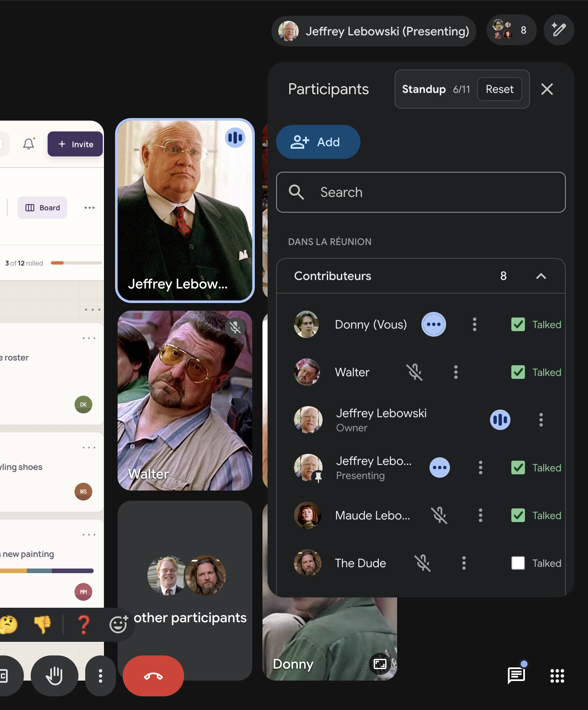

# standup_tracker

`standup_tracker` is a private, local Google Meet bookmarklet for tracking who has already spoken during a standup.

> **Warning**
> `standup_tracker` depends on Google Meet's rendered page structure. Google can change Meet's DOM, labels, participant rows, or speaking indicators at any time, so the bookmarklet can break without notice. If the controls stop appearing or auto-detection becomes unreliable, use the debugging helpers below and update the selector logic in `standup-companion.js`.

The bookmarklet runs entirely inside the current browser page. It does not call a backend, send data anywhere, write to storage, or persist attendance between page refreshes.



## What It Does

- Adds a compact "Standup" toolbar to the Google Meet People panel.
- Shows a talked count for the currently visible participants.
- Adds a "Talked" checkbox to each detected participant row.
- Mirrors talked state onto matched video tiles with a status marker.
- Marks a participant as talked after Meet shows them speaking continuously for 3 seconds.
- Keeps manual changes reversible: check, uncheck, reset, or rerun the bookmarklet to refresh.
- Keeps all state in page memory only; refreshing or leaving the Meet clears the session.

## Usage

1. Open a Google Meet call.
2. Run the `standup_tracker` bookmarklet.
3. Check "Talked" beside each participant as they finish.
4. Watch the toolbar count and the video-tile status markers.
5. Use "Reset" to clear the current standup.

The bookmarklet opens the People panel when it starts. If the panel changes after the bookmarklet starts, the script observes the page and refreshes the controls. Running the bookmarklet again in the same Meet opens the People panel, refreshes, and focuses the existing instance.

## Install

Create a browser bookmark whose URL is the generated bookmarklet payload:

1. Open `standup-companion.bookmarklet.js`.
2. Copy the full single `javascript:` line.
3. Create or edit a browser bookmark.
4. Paste that line into the bookmark URL field.
5. Name the bookmark `standup_tracker`.

## Local Development

There are no package dependencies. Edit the readable source in `standup-companion.js`, then rebuild the generated bookmarklet:

```sh
node build-bookmarklet.mjs
```

Use `test-harness.html` for a local fake Meet page. It loads `standup-companion.js` directly, exposes a fake People panel, and has buttons for testing manual checks, reset, short speaking signals, and the 3-second auto-check behavior.

## Implementation Notes

- Participant discovery is based on the visible Meet People panel, including role, accessibility, data attribute, title, and row text signals.
- Video-tile status markers are added only when a visible tile can be matched to a known participant.
- Speaking detection is inferred from visible Meet UI signals such as tile speaker classes, speaking data attributes, accessibility labels, titles, and status regions. The bookmarklet does not access audio streams.
- A `MutationObserver` keeps participant rows, tile overlays, and speaker state synchronized as Meet re-renders.
- Selector and name-cleaning logic is intentionally isolated in `standup-companion.js` because Meet's DOM is not a stable public API.

## Console API

The running bookmarklet exposes a small operational API:

```js
window.__meetStandupCompanion.refresh()
window.__meetStandupCompanion.focus()
window.__meetStandupCompanion.destroy()
```

It also exposes diagnostics:

```js
window.__meetStandupCompanionDebug.snapshot()
window.__meetStandupCompanionDebug.logSnapshot()
window.__meetStandupCompanionDebug.discover()
window.__meetStandupCompanionDebug.panelCandidates()
window.__meetStandupCompanionDebug.speakerCandidates()
window.__meetStandupCompanionDebug.detectActiveSpeaker()
window.__meetStandupCompanionDebug.traceSpeaking(5000)
```

Use `logSnapshot()` if the bookmarklet does not find participants after opening the People panel. Use `traceSpeaking(5000)` while someone is talking to inspect the DOM changes Meet exposes for active-speaker detection.

## Files

- `standup-companion.js`: readable bookmarklet source.
- `standup-companion.bookmarklet.js`: generated single-line bookmarklet URL.
- `build-bookmarklet.mjs`: dependency-free generator for the bookmarklet payload.
- `test-harness.html`: local fake Meet page for behavior checks.
- `LICENSE`: MIT license.
